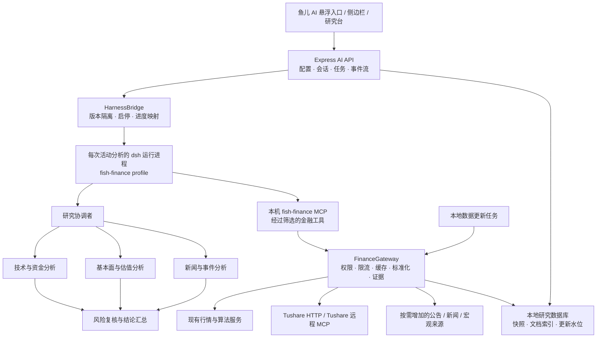

# 可爱鱼儿选股指南：A 股 / 港股 AI 研究助手升级规划

版本：调研与设计稿 v1.0 · 2026-09-20

> 历史设计稿，不是当前发布包的验收记录。当前交互见 `AI-INTENT-CONSULTATION.zh-CN.md`；跨平台发布边界见 `PORTABLE.zh-CN.md`。下文中的未测试状态和设计目标保留其原始时间语境。

范围：现有 React / Express 应用；DeepSeek Harness 运行架构；Tushare Pro HTTP API 与远程 MCP；借鉴 FinceptTerminal 的研究能力和 Copilot 类侧边栏交互。

本文同时记录已经落地的首版实现和后续边界：已接入 DeepSeek Harness SDK、36 个分工角色、证据网关、研究进度/停止接口、长期记忆、Copilot 风格本地面板，以及可选的 Tushare MCP 只读财报工具发现。未使用用户 Token 做真实账户测试；Tushare MCP 仍需用户在本机配置凭据后验证权限。

## 1. 建议先确定的产品方向

将新模块定位为 **“鱼儿 AI：了解你的自选股、持仓和策略的 A/H 股研究助手”**。

用户只需配置模型 API 地址、API Key、模型名称；数据部分优先沿用已经配置的 Tushare Token。助手默认读取当前股票或当前页面，经工具取得新数据，再给出有依据、能追问的分析。高级用户可以进一步配置 API 协议、其他数据源和分析预算。

产品价值由四个环节共同提供：

1. **理解页面上下文**：知道用户正在看哪只股票、哪个推荐模式、哪组持仓。
2. **调用真实数据和现有算法**：行情、财务、公告、TET、MACD-V、韭菜50、10q 月度结果都有明确来源。
3. **分工分析与交叉检查**：技术资金、基本面、新闻事件分别研究；风险复核检查遗漏和相互冲突的结论。
4. **返回可核验的研究卡片**：结论、依据、反向证据、数据时间、缺失项和下一步观察条件。

首版覆盖个股研究、持仓体检、两股比较、推荐理由解释和当日变化。复杂策略回测、任意代码执行、券商交易和自动下单不进入首版范围。

**建议技术决策：保留现有前后端，增加 Harness 独立运行进程和统一金融数据网关；首发面向本地 Windows / macOS 便携版。**

## 2. 调查得到的事实与可行性

### 2.1 现有项目已经具备什么

| 能力 | 当前代码 / API | AI 如何利用 | 必须处理的边界 |
|---|---|---|---|
| A 股、港股行情 | `realtime.ts`、`hkQuotes.ts`；`GET /api/stocks` | 价格、涨跌、成交、估值快照 | 实时、上一交易日与过期行情分开标注 |
| 日线与技术指标 | `GET /api/stocks/:code/daily`、`/signals` | 解读 TET、MACD-V、趋势与量价 | 复用程序计算，注明参数版本和交易日期 |
| 个股详情 | `GET /api/stocks/:code/detail` | 股东、分红、估值、资金信息 | 详情中的 ROE 和部分资金数据属于估算 |
| 今日推荐 / 股池评分 | `/api/recommendations`、`/api/pool-scores` | 解释入选因素、比较候选股 | 当前候选池不是整个 A/H 股市场 |
| 持仓及卖出信号 | `/api/holdings`、`/api/holdings/signals` | 集中度、盈亏、已有风险信号解释 | 仅发送用户本次选择的持仓范围 |
| 韭菜50 | `/api/bagholder50` | 提醒拥挤风险，解释与技术信号的冲突 | 当前为特定 A 股池内算法，不适用于港股 |
| 本月 10q 结果 | `/api/recommendations/monthly` | 解释真实计算结果与因子归因 | 依赖独立 Python / 10q 环境，不能由 LLM 补造名单 |
| A/H 比较 | `ahCompare.ts`；`/signals` 的 `ah_compare` | 同公司两地估值、汇率与分红口径比较 | 静态映射需维护，税务假设需明确，不能宣称无风险套利 |
| 数据质量检查 | `/api/data-quality`、`marketValue.ts` | 引用来源、日期、币种、冲突和缺失 | 当前完善的元信息主要在市值等部分字段，需要扩展 |
| 本地持久化 | `api/local.ts`、`dataDirectory.ts` | 保存 AI 配置、会话和研究材料 | 新配置不能覆盖现有 Tushare 配置 |

重要发现：

- `api/services/tushare.ts` 的 `getNews()`、`getAnnouncements()` 直接返回空数组；`/api/stocks/:code/news` 同样固定返回空数组。新闻 UI 存在不代表新闻数据已经接通。
- `scoring.ts` 和股票详情使用 `PB / PE × 100` 估算 ROE。它不能在报告中被称为财报披露的 ROE。
- 详情在资金流数据缺失时可能使用成交额变化估算净流入，且“大单 + 超大单”也不能直接证明真实机构身份。
- 多个接口在失败时返回 `success: true` 加空数组、零值或 `null`。AI 网关需要结合来源健康状态区分“无数据”“无权限”“请求失败”和“确实为零”。
- `getMonthlyRecommendations(false)` 也可能启动更新。AI 的“解释本月推荐”必须使用新增的只读结果快照，不能直接把这个 GET 当成无副作用工具。

所以，当前代码足以作为研究助手的业务基础，但在接模型前需要建立可信的数据契约。

### 2.2 FinceptTerminal 可以借鉴的部分

本次审查固定版本：

| 仓库 | 提交 | 该提交日期（UTC） |
|---|---|---|
| Fincept-Corporation/FinceptTerminal | `b7d850b49dc033bb133e6e5d2476444ac5c422b1` | 2026-09-19 |
| econivy/FinceptTerminal-CN | `11015c8715107f4b3919b1d318449a3f13cf0e71` | 2026-05-06 |

核实到的实现：

- 当前为 **C++20 / Qt6 + Python**，与本项目技术栈不同。
- 新闻服务包含 RSS / Atom 并发抓取、缓存、定时刷新、渐进式展示和 WebSocket 新闻流；部分新闻分析、新闻摘要依赖 Fincept 自有 `/news/analyze`、`/news/summarize` 服务。
- `finagent_core/modules/team_module.py` 基于 Agno Team，提供角色分工、任务路由和协作配置。
- `LlmToolLoop.cpp` 实现模型调用工具、回传结果、继续分析，以及执行轮次 / 时间预算。
- `deepagents/orchestrator.py` 的一个降级路径是顺序角色提示词和结果汇总；这个路径本身不能证明已经获取实时外部数据。
- CN 仓库包含多空分析及汇总示例，但抽查不能证明它比上游具备完整、已验证的 A 股 / 港股数据覆盖。

借鉴优先级：

| Fincept 能力 | 本项目采取的方式 |
|---|---|
| Equity Research | 个股研究模板：经营、估值、技术、事件与风险 |
| Portfolio Analytics | 持仓集中度、相关性、风险信号与情景分析 |
| News Intelligence | 事件去重、来源引用、公司关联、影响与反向证据 |
| 多 Agent | 使用 Harness 子 Agent 实现任务分工和复核 |
| 数据连接器 | 统一数据网关，优先现有 API 与 Tushare MCP |
| 模型配置与聊天 | 自有设置页、侧栏、任务进度、历史会话 |
| 全市场筛选、复杂量化 | 后续独立数据和计算工程，不把聊天直接当成筛选器 |

不能把开源仓库的连接器数量或商业版介绍等同于“免费获得每日全部最新数据”。上游自有服务、数据供应商权限和网络可达性仍是独立条件。

许可证方面，两个仓库标称 AGPL，但所读取的 LICENSE 还含商业 / 内部使用限制；上游 README 与 LICENSE 的商业授权表述也有不一致。当前项目为 MIT，建议按公开架构独立实现。若将来直接复制或分发上游代码，需要另行澄清具体授权。DeepSeek Harness 当前为 MIT，可按其许可使用并保留版权与第三方说明。

### 2.3 DeepSeek Harness 的适配结论

调查版本：`deepseek-ai/deepseek-harness@ddefc45fbc7f8e46dd73185e68295696d1297887`，源码包版本 `0.1.6-alpha.2`。这是源码快照，不等于已验证 npm 所有依赖均可成功安装。

| 事项 | 已核实的能力 / 限制 | 设计决策 |
|---|---|---|
| 架构 | Cordis 插件、profile、工具注册、会话事件、模型适配器 | 制作应用专用 `fish-finance` profile / bundle |
| TypeScript SDK | `@deepseek-ai/dsh-sdk-client` 通过 stdio JSON-RPC 驱动 dsh 子进程 | Express 经桥接层驱动，前端无需运行 Harness |
| 模型协议 | 自定义提供方支持 `openai-completions`、`openai-responses`、`anthropic-messages` | 普通界面默认兼容聊天协议，高级界面可选协议 |
| MCP | stdio 与 Streamable HTTP；工具发现、结果和取消机制 | Tushare 先握手验证，再通过金融网关接入 |
| 子 Agent | spawn / fork，模型继承、结构化输出、工具过滤和深度约束 | 首版用 spawn，显式传任务、证据和白名单 |
| Agent Teams | 官方标为实验性，包含任务 DAG、成员和消息机制 | 首版先用受控子 Agent 工作流，Teams 作为后续试验 |
| 默认 profile | 面向编程；`sdk-minimal` 默认含持久 shell、全访问权限，并缺少多项产品服务 | 不直接使用未经裁剪的默认配置 |
| SDK 取消 | 当前没有单轮取消 RPC；放弃运行需要关闭运行时 | 每个活动分析独占进程；停止时关闭本次进程 |
| SDK 审批 | 服务端向客户端请求的审批流程尚未实现 | 产品写操作通过自己的确认卡片处理 |
| 子 Agent 权限 | spawn 子级不会自动继承父级的工具限制与权限作用域 | 每个角色显式配置，并在网关再次校验 |
| 会话结果 | 高层 `run()` 返回进入 idle 前的最后根响应，不保证逐输入因果归属 | 同一会话首版串行执行，不混入其他任务消息 |
| 版本与运行时 | 开发者预览，会有破坏性变更；根目录要求 Node `^22.19.0 || >=24` | 锁定版本和依赖，设置桥接接口及升级回归 |

本项目便携包当前内置 Node `22.23.2`，满足该版本声明的 Node 范围；还需验证 Windows / macOS 原生依赖、包发现和启动退出。现有 `build-local.mjs` 只把后端打成单文件，不能假定 Harness 的插件、配置和原生依赖也能全部内联到这个文件。

## 3. 总体架构



### 3.1 各层职责

- **前端**：展示配置、上下文、输入、任务进度、报告和来源；不给浏览器模型或 Tushare 凭证。
- **Express**：拥有用户配置、会话索引、任务状态和预算；提供稳定的应用 API。
- **HarnessBridge**：将 dsh 事件转换为本产品事件；负责启动失败、退出、恢复以及版本差异。
- **金融 profile**：模型适配、会话持久化、受控子 Agent、金融工具及结构化报告。移除 shell、任意文件读写、插件安装、通用网络和计算机控制工具。
- **FinanceGateway**：同一数据请求只取一次；保留提供方信息；把 Tushare MCP 和现有 API 统一成可验证的金融数据。
- **本地数据库**：保存来源、证据、快照、会话关联和任务水位。初期使用 SQLite + 全文检索；若引入驱动需验证多平台打包。短公告和有限新闻不必第一版就引入向量数据库。

这些都是计划新增的应用模块名称；`fish-finance`、`HarnessBridge`、`FinanceGateway` 并非上游现成包。

### 3.2 为什么保留现有 HTTP API，又增加 MCP

MCP 解决模型如何发现和调用工具；已有 HTTP 服务承载本项目的选股逻辑，两者可以共存。

- 高频行情、TET / MACD-V、评分、持仓、韭菜50、A/H 比较优先复用现有服务。
- Tushare MCP 用于已验证开放的财务、交易日历、公告、新闻和宏观等能力；工具名称和实际范围以 `tools/list` 为准。
- 同一数据集通过 MCP 或 HTTP 获取都记为 Tushare 来源，不能当成两个独立来源交叉验证。
- 模型只看到少量经过筛选的金融工具，不同时暴露全部原始 MCP 工具与另一套同义工具。
- 原型阶段可以让 Harness 直连 Tushare MCP 验证兼容性；正式版由本机金融 MCP 网关统一限流、分页、字段校验和证据登记。

## 4. Tushare Pro 与 MCP 接入设计

### 4.1 用户提供的远程服务

已知端点形式为：`https://api.tushare.pro/mcp/?token=<TUSHARE_TOKEN>`。

文档不收录实际 Token。这个 `mcpServers` JSON 是常见客户端配置格式，**不能假定原样粘贴到 Harness 就会生效**；Harness 的官方客户端配置采用 Cordis 插件条目。

仅用于连通性原型的配置形态如下，具体以锁定版本验证为准：

```yaml
- id: tushare-research-mcp
  name: '@deepseek-ai/dsh-mcp-client'
  config:
    serverName: tushare
    transport: streamable-http
    url: !!js process.env.FISH_TUSHARE_MCP_URL
    toolCallTimeoutMs: 20000
    maxInstructionBytes: 8192
```

`FISH_TUSHARE_MCP_URL` 由后台临时构造，不能进入前端、Git、报告或普通日志。正式版 dsh 连接的是本机金融网关，Tushare 认证由网关持有。若供应商只支持 URL Token，就对完整 URL、查询参数和错误对象统一脱敏；不擅自改成未经证实可用的 Header 认证。

### 4.2 第一阶段必须完成的接入验证

1. 使用用户本机已保存的凭据执行 `initialize`，记录实际协商协议、传输方式和 `serverInfo`。
2. 分页执行 `tools/list`，保存脱敏的工具名、输入 schema、输出结构与发现时间。
3. 建立工具到业务能力的映射：A 股日线、港股日线、财务指标、公告、新闻、日历等。发现了工具不代表账户获准读取该数据。
4. 对每类能力执行最小日期范围、最少标的的读取探测；区分成功、空数据、权限不足、限流和响应异常。
5. 建立账户能力矩阵，展示“可用 / 未验证 / 无权限 / 暂时不可用”。连接成功不能被展示为“全部数据已开通”。
6. 验证取消、超时、重连、会话标识和分页；如果仅支持旧 SSE 而非 Streamable HTTP，需要明确适配，不能仅根据 URL 猜测兼容。

### 4.3 配置复用

- 用户已配置 Tushare：后台提供“沿用现有 Token”的默认选项；实际探测后确认 MCP 是否接受同一凭据。
- 单独 MCP Token：放在“数据源 → 高级设置”，普通用户无需看到 MCP 配置 JSON。
- 后台统一配置存取，不在 `PUT /api/local/config` 中继续用单字段对象覆盖整个配置文件。
- 凭据读取接口只返回 `configured`、脱敏描述及能力状态。Harness 的凭据文件不是天然加密保险箱；首版使用会话临时保存或操作系统凭据存储，持久保存方式需在 P0 打包验证中确定。
- 已提供的 URL 含有效凭据，应按凭据处理；如它已被分享给其他人，应在供应商侧更换。

### 4.4 账户权限与数据覆盖

官方文档明确：`news` 新闻快讯、`major_news` 长新闻、`anns_d` 公告需要单独权限，并非拥有普通 Tushare 积分即可使用。`fina_indicator` 也有相应积分门槛。具体以用户账户实际探测为准。

Tushare 文档列有港股日历、行情、财务三表和财务指标，但仍需分别验证账户权限和 MCP 是否暴露这些工具；不能把 A 股公告接口视为港股公告来源。

推荐数据顺序：

| 类别 | 首选 | 补充 / 降级 |
|---|---|---|
| A 股实时与日线 | 现有新浪 + Tushare | 已有腾讯回退；不把延迟数据包装为实时 |
| 港股实时与日线 | 现有腾讯 / 新浪；补齐 Tushare 港股数据 | 明确延迟、币种和交易日历 |
| 财报及财务指标 | 已授权 Tushare HTTP / MCP | 公司原始披露；取不到则仅作估值与技术分析 |
| A 股公告 | 已授权 Tushare 公告 | 交易所 / 巨潮公开披露的合适接口，需核实访问方式与使用条件 |
| 港股公告 | HKEXnews / 公司披露或已授权的对应数据源 | 无覆盖时明确缺失，不从 A 股公告推断 |
| 新闻 | 已授权 Tushare 新闻 | 少量核实可用的 RSS / 新闻提供方；AKShare 作为可选适配 |
| 宏观与行业 | 已授权 Tushare、官方发布 | 按投资问题选择相关数据，不默认拉取全球全部信息 |

AKShare 是 Python 数据适配库，不是稳定性和权限都由其保证的统一数据服务。引入它将增加运行环境及维护成本，适合放在可选扩展阶段。

## 5. “每日最新信息”应该怎样实现

将数据更新和模型分析分开。后台定时抓取、去重和缓存数据；用户咨询时使用最新可用快照，过期的部分按需刷新。每天无变化的原始数据无需反复消耗模型 Token。

### 5.1 更新范围与节奏

首期覆盖自选股、持仓和当前研究对象，再覆盖相关行业及大盘。全 A/H 股逐只读取所有新闻、财务和指标需要单独设计批量数据管线。

以下是产品目标频率，实际受供应商频率、交易时段及权限约束：

| 数据 | 更新策略 | 时效展示 |
|---|---|---|
| 交易日历 | 每日检查，分别维护沪深北和港股 | 当前市场开市 / 收市 / 休市 |
| 行情 | 复用现有约 30 秒缓存，咨询前检查 | 提供方时间，不用本机抓取时间代替 |
| 日线与资金流 | 收盘后增量补齐；等待供应商落库后重试 | 明确是哪个交易日，资金流可能滞后 |
| 新闻 / 公告 | 启动补拉；运行中每 5–15 分钟有界轮询 | 发布时间、抓取时间、覆盖范围 |
| 财务 | 每日检查新披露，有变更再拉明细 | 报告期、公告日期、修订版本 |
| 盘前摘要 | 交易日 08:45 后，在应用运行且用户开启时生成 | 截止时间与未覆盖项 |
| 收盘复盘 | 按 A / H 市场收盘及数据落库情况分别生成 | 未完成结算的数据标记待更新 |

本地程序关闭、电脑休眠时不会持续采集。首版重启后按更新水位补拉，并显示“上次成功更新”。如果要求关机期间也持续采集，后续需要常驻服务或云端任务；Vercel 单次请求和浏览器定时器无法保证这件事。

### 5.2 新闻和公告的处理链

采集 → 规范时间和来源 → 内容哈希 / 原始 URL 去重 → 公司与行业关联 → 保存原文索引 → 检索相关片段 → 形成证据。

- 搜索时间窗口默认随问题选择，例如“今天”“最近一周”；标题和报道相似不等于多个独立消息。
- 关联公司时记录代码匹配、别名匹配或语义推断的依据，模糊匹配不直接当成确定事实。
- 区分公告原文、新闻报道和评论；转载新闻尽量回溯原始出处。
- 只有标题 / 摘要就标明“仅摘要”，不生成假装读过全文的结论；PDF 无法提取时保留缺失状态。
- 未找到事件时回答“在已覆盖来源和时间范围内未检索到”，不能回答“市场没有任何利空”。
- 缓存和历史查询保存 `publishedAt`、`knownAt` / 首次可知时间与修订记录，避免历史分析使用未来信息。

## 6. 数据与证据契约

首要原则：**模型负责解释和形成假设，代码负责数据口径、财务计算和已有策略信号。**

建议所有金融工具返回统一外壳：

```ts
type EvidenceRecord = {
  id: string;
  snapshotId: string;
  symbol?: string;                 // 600036.SH / 03968.HK
  market?: 'SH' | 'SZ' | 'BJ' | 'HK';
  provider: string;
  transport: 'http' | 'mcp' | 'local';
  dataset: string;
  asOf: string | null;             // 事实有效时间
  fetchedAt: string;               // 抓取时间
  publishedAt?: string;
  reportPeriod?: string;
  currency?: 'CNY' | 'HKD' | string;
  unit?: string;
  adjustment?: 'none' | 'qfq' | 'hfq';
  status: 'available' | 'previous_close' | 'stale' |
          'missing' | 'unavailable' | 'conflict';
  valueKind: 'reported' | 'observed' | 'calculated' | 'estimated';
  method?: string;
  sourceUrl?: string;
  payload: unknown;
};
```

执行要求：

- `null` 表示缺失，不能统一填零；API 失败必须带错误分类。
- 每次分析创建 `snapshotId`，各角色使用同一份基础快照；数据时间不一致时展示各自时间，不伪装为同一秒快照。
- 收益、权重、相关性、最大回撤由确定性代码计算，数据不足就不输出；价格复权、交易日对齐和除权事件先处理。
- 资金流不是资金归属证明；估算 ROE 与披露 ROE 使用不同字段。
- 市值、成交额、币种、股 / 手、元 / 万元分别规范，A/H 比价先对齐汇率和取价时间。
- 历史信号必须标记参数版本；10q 报告只引用已完成的真实结果。
- 每条关键事实关联证据 ID。后台检查 ID 存在、标的和日期一致、数值与来源相符；数字核验和引用核验不能完全交给另一个 LLM。
- 没有公开 URL 的结构化行情可以引用本地“数据来源详情”，不能编造网页链接。
- “证据覆盖充分”与“股价将上涨的概率”是不同概念，界面不展示未经校准的胜率或虚构置信分。

## 7. 多 Agent 研究流程

### 7.1 角色及工具边界

| 角色 | 主要问题 | 输入 / 可用工具 | 输出 |
|---|---|---|---|
| 协调者 | 用户想解决什么、研究哪些股票、需要哪些数据 | 问题、当前页面、范围与预算 | 研究计划、适用模板、补充问题 |
| 技术与资金分析员 | 趋势、量价、信号是否一致 | K 线、现有信号、资金流、拥挤指标 | 支持 / 反对证据、观察条件 |
| 基本面与估值分析员 | 盈利质量、现金流、负债、估值是否匹配 | 真实财务、估值、分红、同业数据 | 经营变化与估值假设、缺失项 |
| 新闻与事件分析员 | 最近发生了什么，如何影响该公司 | 有时效的新闻、公告和行业 / 宏观证据 | 事件时间线、可能影响、未经证实的关系 |
| 风险复核者 | 哪些判断可能错，遗漏了什么 | 共享证据与各角色结构化输出 | 矛盾、数据问题、反向情景、限制 |
| 汇总者 | 如何向用户解释并给出下一步 | 经过校验的角色输出 | 结论卡、证据、反例、观察计划 |

汇总可由协调者继续完成，无需永久运行六个模型。所有角色默认使用用户配置的同一个模型和凭据；多 Agent 是角色、工具和任务边界，不要求购买多个模型。

### 7.2 三档执行路径

**快速问答**：解释术语、已有评分、某条信号。读取必要工具后由单 Agent 回答；不运行新闻、基本面等无关角色。

**综合分析（默认）**：有界计划 → 收集共享证据 → 按问题启动 2–3 个专长角色 → 风险检查 → 结论。目标通常约 4–8 次模型请求，但工具往返、重试及模型行为会改变实际次数，不能作为固定计费承诺。

**深度研究（用户选择）**：扩大历史区间、同业比较、额外公告原文和有限一轮补证；遵循独立预算，达到上限就交付部分结果并说明缺口。

不采用多个角色轮流重复同一句判断的无限辩论。复核发现缺少来源时，只允许提出具体补证请求；没有新证据就保留分歧。

### 7.3 有界编排

建议首版默认：最多 3 个并行专长 Agent，委派深度 1，每次任务最多 12 次数据工具调用（批量、分页计数另设硬上限），普通综合分析整体时限 120 秒，单次供应商请求 15–20 秒。均为待原型测量后调整的产品参数。

运行约束：

- 相同 `dataset + symbols + dateRange + fields + adjustment` 请求合并；不同角色共享缓存和提供方限流器。
- 运行前冻结模型 / 配置版本，修改模型只影响下一次分析。
- 同一会话只允许一项活动分析。新问题排队或先停止当前任务，避免 SDK `run()` 结果归属混乱。
- 子 Agent 用 fresh context，只接任务所需材料；不默认复制全部聊天、持仓及凭据。
- 工具白名单、委派深度、调用预算由代码执行；不能只写在提示词里。
- 单个角色失败允许部分完成；只有技术数据时给出“技术分析”，不标成“完整基本面研究”。
- 持仓风险与普通问答分别最小化上下文；用户长期偏好仅在主动保存后记忆，市场事实按新快照更新。

### 7.4 示范问题

用户在招商银行详情页问：“A 股和 H 股现在怎么比较？结合我已有持仓看看。”

执行顺序：解析 `600036.SH / 03968.HK` → 用户选定持仓范围 → 获取两地价格、汇率、估值和财务 → 调用已有 A/H 比较逻辑并展示其税务假设 → 获取可用公告与新闻 → 估值 / 技术 / 风险角色分析 → 汇总分歧和观察条件。

报告明确：两地报价时间是否一致，分红税务适用哪个投资者类型，港股通资格和交易规则是否已核验，哪些结论只在某种持有期或汇率假设下成立。不能把折价直接等同于应当买入或可即时套利。

## 8. 面向用户的交互设计

### 8.1 首次使用

导航栏新增常驻“设置”入口。设置里增加“AI 助手”，即使未配置 AI 也能进入。

默认表单只有三项：

1. API 地址：示例 `https://provider.example/v1`。
2. API Key：只写入后台，不在读取接口回显。
3. 模型名称：可以手填；获取模型列表只是便利功能，失败不阻止手填。

“测试并启用”依次检查 URL、模型调用、流式能力及最小工具调用。测试会产生少量模型用量，按钮旁明示。默认按常用兼容聊天协议；遇到 Responses 或 Anthropic 原生服务，通过“高级 → API 协议”选择，不能承诺任意 URL 都自动兼容。

模型可用但不支持工具调用时，可启用“基础解读”模式：由后端按固定模板采集数据，再交给模型解释；不能显示为具备自主研究能力。连通性失败保留设置入口并给出可修正错误。

Tushare 数据源卡显示“沿用现有配置”，测试后列出行情、财务、新闻、公告、港股的能力状态。**模型是否可用决定 AI 图标是否出现；某个数据集不可用只影响对应分析能力。**

### 8.2 悬浮入口与侧边栏

- 默认右下角约 48px 鱼儿 / Sparkles 图标，距边缘约 20px；支持设置为左下角，移动端避开底部安全区。
- 未配置或主动停用时不显示悬浮入口；已启用但临时网络失败时仍保留图标，打开后展示恢复操作，避免入口忽然消失。
- 点击打开研究侧边栏；桌面推荐宽度 420–480px，大屏推开主内容，小屏转为全屏面板。
- 顶部包含“鱼儿 AI”、新对话、历史、展开研究台、关闭。
- 输入框支持 Enter 发送、Shift+Enter 换行；中文输入法组词期间不触发发送。
- 推荐快捷入口：“解释当前信号”“分析这只股票”“比较两只股票”“检查我的持仓”“今天有哪些变化”。
- 模型名称和数据更新时间放在次级位置，普通用户不必选择 Agent 名称、工具名称或框架参数。

### 8.3 当前界面冲突需要专门处理

现有 `DetailPanel` 位于右侧并带全屏遮罩，`AlertPanel` 也位于右上方；简单再叠一个右侧聊天窗会相互遮挡。

新增统一 `panelCoordinator`：

- 大屏进入 AI 时把股票详情转换为研究上下文，研究台中可以并排查看必要资料。
- 中小屏在“详情 / AI”之间切换，同一时刻只保留一个主遮罩，保留原来的滚动和选股状态。
- 打开来源面板也使用同一面板协调，不连续覆盖三层抽屉。
- 现有字体档位会修改根字号，必须测试所有档位，不能只在默认字号下看起来正常。

### 8.4 显式、可撤销的上下文

输入框上方显示上下文标签：`招商银行 600036.SH ×`、`持有仓位 ×`、`近 7 日事件 ×`。

- 当前股票可以自动选中；完整持仓和成本信息由用户选择是否附带。
- 用户切换股票时，当前任务维持原快照；下一次发送前显示新的上下文提示，不悄悄把旧对话变成新股票。
- 从评分卡点“让 AI 解释”时携带具体评分模式、参数版本、计算时间和必要字段。
- 两股同名或代码不明确时先给可点击候选项，减少要求用户重新组织问题。

### 8.5 分析过程与报告

任务卡显示真实执行状态：“正在取行情”“已获得财报”“正在核对公告”“正在复核风险”。可展开查看角色结论和已调用的数据来源，不展示模型内部思维过程，不用伪造百分比进度。

最终报告建议顺序：

1. **一句话结论**：回答用户问题，指出适用的时间范围。
2. **支持依据**：关键事实、程序指标、来源引用。
3. **反向证据 / 主要风险**：各角色冲突和最容易失效的假设。
4. **接下来观察什么**：具体事件、指标变化或条件，而不是无依据的目标价。
5. **数据范围与缺口**：截至时间、已覆盖来源、过期 / 无权限 / 缺失项。

引用点开查看来源、原始值或原文片段、数据日期、计算方法。可继续追问“展开基本面”“只看反面理由”“与另一只股票比较”。

### 8.6 停止、错误、历史与操作

- 点击停止立即进入“正在停止”，Bridge 关闭本次独占的 Harness 进程，同时取消网关中对应 runId 的未完成请求；确认进程退出后显示“已停止”。供应商已接收的请求可能仍计费。
- 部分证据已获取但模型失败时，保存任务记录并允许从有效快照重试，不重复拉全量数据。
- 断线后重新打开可加载已持久化事件；如果进程中途崩溃，标为“中断”，不能把残缺流式文本当成完成报告。
- 历史回答保持原数据时间，“用最新数据重新分析”创建新运行，不能篡改旧结论。
- “保存报告”是本地用户操作；“添加自选 / 创建提醒”先生成明确操作卡，用户点击后调用现有业务 API。
- 首版分析工具不开放持仓改写、策略参数修改和交易工具，因此普通数据查询不需要不断弹确认框。

## 9. 后端接口、文件和运行生命周期

### 9.1 计划新增的应用接口

| 接口 | 用途 |
|---|---|
| `GET /api/ai/config` | 返回启用状态、模型描述、能力状态；不返回明文 Key |
| `PUT /api/ai/config` | 校验并保存配置；与原设置合并 |
| `POST /api/ai/config/test` | 验证当前表单模型及工具能力 |
| `GET /api/ai/capabilities` | 数据源、账户权限、模型功能与更新状态 |
| `POST /api/ai/sessions` | 创建会话，返回 sessionId |
| `GET /api/ai/sessions` | 会话历史索引 |
| `GET /api/ai/sessions/:id` | 消息、报告及当前任务状态 |
| `POST /api/ai/sessions/:id/runs` | 提交问题、标的、上下文和模式；返回 runId |
| `GET /api/ai/runs/:id/events` | SSE 任务和结果流，支持事件序号恢复 |
| `POST /api/ai/runs/:id/cancel` | 应用层停止，本版映射到关闭专用进程 |
| `GET /api/ai/evidence/:id` | 获取脱敏的证据详情 |
| `GET /api/ai/data-status` | 来源更新水位、时效和失败原因 |

可再按需要增加删除会话、报告导出和用户确认操作接口。以上路径是本项目提案，不是 Harness 官方 API。

应用事件示例：`run.started`、`data.updated`、`role.started`、`role.completed`、`answer.delta`、`evidence.ready`、`run.completed`、`run.failed`、`run.cancelled`。由 Bridge 转换，不直接把上游完整事件及敏感错误透传到浏览器。

### 9.2 建议文件布局

```text
src/components/ai/
  AiLauncher.tsx          AiPanel.tsx          AiSettings.tsx
  AiComposer.tsx          AiRunProgress.tsx    AiResearchReport.tsx
  AiEvidencePanel.tsx     AiContextChips.tsx
src/store/aiStore.ts
src/store/panelStore.ts
src/services/aiClient.ts
src/types/ai.ts

api/routes/ai.ts
api/services/ai/
  configStore.ts          harnessBridge.ts     runManager.ts
  sessionStore.ts         evidenceStore.ts     reportValidator.ts
  financeGateway.ts       capabilityProbe.ts   dataScheduler.ts
  toolRegistry.ts         financeMcpServer.ts  credentialStore.ts
  providers/tushareMcp.ts
  providers/existingServices.ts
  providers/newsProvider.ts

ai-runtime/
  profiles/              plugins/             prompts/

tests/ai/                # 关键行为和回放用例
```

现有 `stocks.ts` 中部分计算与读取直接写在路由内，需要逐步抽成共享服务。AI 与旧页面使用同一份服务，避免复制评分和信号算法造成结果分叉。

### 9.3 打包和存储

- 锁定同版本 dsh 与 SDK，随发布包交付需要的产物；用户首次使用不要求安装 pnpm、Python 或手动运行命令。
- 指定 `dshBin`，验证 esbuild 之后的包路径解析；保留所需插件、profile、动态资源和第三方许可。
- 每次活动 run 独占子进程，结束后回收；会话数据保存在应用自己的 Harness home，下一轮恢复同一会话。
- 单次 run 的可执行目录和研究材料目录受应用控制，不使用整个源码目录作为用户工作区。
- Windows 子进程隐藏窗口；退出应用时回收所有活动进程，避免后台遗留持续计费任务。
- 新功能的数据保存在当前 `CUTE_FISH_DATA_DIR` 下；配置、凭据、会话、证据和缓存有独立版本及迁移策略。

本地版已有 Host / Origin 访问保护，应覆盖新增 AI 和内部 MCP 路由。源码开发入口及 Vercel 入口没有同等完整认证：上线共享服务前必须补充账户隔离、认证、限额和服务器凭据管理，不能把本地配置读写 API 直接公开。

Vercel 版暂不承载 Harness 常驻进程和长任务。若需要云端，多用户前端连接专用常驻 Node 服务 / Worker 队列体系，由其运行进程、持久化任务与采集；这属于另一个部署阶段。

## 10. 分阶段实施与验收

以下是熟悉项目的一名开发者的初步有效工作日估算，不包含数据采购、供应商审批或等待上游修复；应在 P0 后重新估算。

| 阶段 | 工作内容 | 交付和通过条件 | 初估 |
|---|---|---|---|
| P0：技术验证 | 锁定 Harness；模型 / MCP 握手；金融 profile；停止机制；便携包原型 | Windows / macOS 启停成功；金融工具可调用；无 shell / 通用文件工具；Token 不进日志；能力矩阵真实 | 2–3 天 |
| P1：可用的助手入口 | 三项模型设置、图标 / 侧栏、当前股票上下文、快速解读、引用 / 历史 | 用户在约 3 分钟内配置完成；行情与信号有证据；配置失败可修正；停止真实生效 | 4–6 天 |
| P2：完整研究数据 | 财务、新闻 / 公告适配、每日增量、权限降级、统一证据、A/H 日历 | 不再把估算当事实；新闻缺失有明确说明；休市不误报陈旧；A/H 字段与币种正确 | 5–7 天 |
| P3：多 Agent 分析 | 有界分工、风险复核、持仓体检、个股比较、结构化报告 | 子级白名单有效；同一快照；失败可部分完成；关键事实及引用通过校验 | 4–6 天 |
| P4：发布与体验 | 面板协调、移动端 / 字号、重连、崩溃恢复、预算 / 缓存、回归 | 原有功能无回归；发布包可直接用；无遗留进程；达到回放评测门槛 | 3–5 天 |

总计约 18–27 个有效工作日。P1 可做内部演示；包含“每日信息 + 多 Agent”的对外版本应完成 P0–P4，并明确实际数据源覆盖。

首期完成后再考虑：研究台并排对照、持仓事件提醒、长期跟踪议题、财报全文检索、程序化情景分析、全市场批量筛选。是否引入实验性 Agent Teams，应由它是否能改善这些具体任务决定。

## 11. 质量、成本与验收用例

### 11.1 应重点测什么

建立固定的离线证据集和带权限分层的联网小样本，覆盖至少 30 个典型研究问题。目标是回答可追溯、计算一致、状态正确；不能用短期股票涨跌作为助手质量验收。

必须包含：

1. A 股与港股同名股票、五位港股代码和 A/H 配对。
2. 周末 / 节假日、沪港交易日不同、停牌、当日无报价。
3. ROE 只有估算值、资金流回退值、负 PE、缺失财务和修订财报。
4. Tushare MCP 连接成功但新闻权限失败；HTTP 200 中含业务错误。
5. 公告只有 PDF 链接、新闻只有标题、重复转载、过期新闻被重新抓取。
6. 同一事实来源冲突；报告中的证据 ID 不存在或引用与数字不符。
7. 提示注入文字混入新闻 / MCP 描述，要求泄露 Token、改配置或执行命令。
8. 子 Agent 试图调用超出其白名单的工具、重复取数或继续委派。
9. 中途停止、关闭页面、进程崩溃、应用重启、模型配置切换。
10. 月度推荐正在计算 / 不可用，AI 不能触发重算或生成虚构持仓。
11. 财务历史查询不能引用后来披露的数据；港股财务报告币种与交易币种不同。
12. 仅当前股票上下文时，不向模型提交全部持仓及成本。

### 11.2 可测的发布门槛

- 测试集中的数字性关键事实和来源引用全部能回溯到证据；缺失证据的结论明确删除或降级。
- 无权限、失败、零值和空记录在工具结果及 UI 中能够区分。
- 财务披露与估算字段不会互相替代；跨币种计算先统一口径。
- 停止任务后无新的模型请求，已在途的供应商请求单独记录；所有本地子进程最终退出。
- 数据源失败不会破坏原有盯盘功能，AI 停用时没有模型请求。
- 凭据不进入浏览器存储、模型上下文、报告、普通日志或诊断导出。
- 字号三档、亮暗主题、320px 移动布局与详情面板切换均可用。

延迟先按固定模型、固定网络与热 / 冷缓存分别测量 P50 / P95。可将快速问答约 15 秒、综合分析约 60 秒作为初始体验目标，但不是所有自定义模型的保证；120 秒任务预算到达时应明确结束或返回部分结果。

### 11.3 费用控制

- 按任务累计所有角色、重试和摘要的输入 / 输出用量；仅有 `maxTokens` 不能限制一次多 Agent 任务的总费用。
- 若用户未配置准确单价，仅显示供应商 usage 或标注为估算的 Token 数，不虚构人民币费用。
- 高级设置提供任务 Token 上限、并发上限和每日预算；达到预算停止新调用。
- 数据定时更新默认不调用模型；日报总结需用户开启，按内容哈希避免重复生成。
- 缓存策略包括问题类型、模型版本、证据快照和提示模板版本。市场数据变化后不直接复用旧结论。

## 12. 推荐实施顺序

第一步做一个小闭环：**配置模型 → 当前股票 → 获取真实行情与既有信号 → 返回带来源的解释 → 可停止、可恢复历史**。同时完成 Tushare MCP 的账户能力探测。

第二步补齐真实财务、公告和新闻，建立每日更新及缺失降级；这是从“能聊天”升级到“能研究”的关键。

第三步再增加多 Agent 分工和风险复核。角色共享同一份证据，用现有算法提供确定性结果，由模型解释矛盾、形成情景与下一步观察条件。

此方案保留用户只配置一个模型的简单体验，也保留未来接入更多模型和金融数据源的扩展空间。

## 13. 调研来源与复核范围

### DeepSeek Harness

- [用户指定的快速入门](https://deepseek-harness.github.io/deepseek-harness/guide/quickstart)
- [固定版本 README：预览状态与 MIT](https://github.com/deepseek-ai/deepseek-harness/blob/ddefc45fbc7f8e46dd73185e68295696d1297887/README.zh.md)
- [架构、profile 与插件](https://github.com/deepseek-ai/deepseek-harness/blob/ddefc45fbc7f8e46dd73185e68295696d1297887/docs/architecture.zh.md)
- [TypeScript SDK，包括取消与审批限制](https://github.com/deepseek-ai/deepseek-harness/blob/ddefc45fbc7f8e46dd73185e68295696d1297887/packages/sdk/client/README.zh.md)
- [MCP 客户端与配置字段](https://github.com/deepseek-ai/deepseek-harness/blob/ddefc45fbc7f8e46dd73185e68295696d1297887/packages/mcp/mcp-client/README.zh.md)
- [自定义模型提供方](https://github.com/deepseek-ai/deepseek-harness/blob/ddefc45fbc7f8e46dd73185e68295696d1297887/docs/user/guide/providers.zh.md)
- [进程内 spawn 子 Agent 与权限作用域](https://github.com/deepseek-ai/deepseek-harness/blob/ddefc45fbc7f8e46dd73185e68295696d1297887/packages/subagent/subagent-spawn-in-process/README.zh.md)
- [sdk-minimal 的默认工具及权限](https://github.com/deepseek-ai/deepseek-harness/blob/ddefc45fbc7f8e46dd73185e68295696d1297887/packages/bundle/sdk-minimal/README.zh.md)
- [实验性 Agent Teams](https://github.com/deepseek-ai/deepseek-harness/blob/ddefc45fbc7f8e46dd73185e68295696d1297887/docs/subsystems/agent-team.zh.md)

### FinceptTerminal

- [上游新闻服务与自有服务调用](https://github.com/Fincept-Corporation/FinceptTerminal/blob/b7d850b49dc033bb133e6e5d2476444ac5c422b1/fincept-qt/src/services/news/NewsService.cpp)
- [上游多 Agent Team](https://github.com/Fincept-Corporation/FinceptTerminal/blob/b7d850b49dc033bb133e6e5d2476444ac5c422b1/fincept-qt/scripts/agents/finagent_core/modules/team_module.py)
- [上游模型工具循环](https://github.com/Fincept-Corporation/FinceptTerminal/blob/b7d850b49dc033bb133e6e5d2476444ac5c422b1/fincept-qt/src/services/llm/LlmToolLoop.cpp)
- [角色提示词降级编排](https://github.com/Fincept-Corporation/FinceptTerminal/blob/b7d850b49dc033bb133e6e5d2476444ac5c422b1/fincept-qt/scripts/agents/deepagents/orchestrator.py)
- [CN 多空分析示例](https://github.com/econivy/FinceptTerminal-CN/blob/11015c8715107f4b3919b1d318449a3f13cf0e71/fincept-qt/scripts/agno_trading/core/debate_orchestrator.py)
- [上游 LICENSE](https://github.com/Fincept-Corporation/FinceptTerminal/blob/b7d850b49dc033bb133e6e5d2476444ac5c422b1/LICENSE) · [CN LICENSE](https://github.com/econivy/FinceptTerminal-CN/blob/11015c8715107f4b3919b1d318449a3f13cf0e71/LICENSE)

### Tushare

- [官方接口目录，含港股数据](https://tushare.pro/document/2)
- [新闻快讯及权限](https://tushare.pro/document/2?doc_id=143)
- [长篇新闻及权限](https://tushare.pro/document/2?doc_id=195)
- [上市公司公告及权限](https://tushare.pro/document/2?doc_id=176)
- [财务指标及权限](https://tushare.pro/document/2?doc_id=79)
- 用户提供的官方域名 MCP 配置已作为接入设计输入，本文只保存无凭据端点；账户工具清单、权限和限流仍待 P0 实测。

### 本项目关键代码

- [应用结构](../src/pages/Home.tsx)、[股票详情抽屉](../src/components/DetailPanel.tsx)、[提醒面板](../src/components/AlertPanel.tsx)
- [现有股票 API](../api/routes/stocks.ts)、[Tushare 适配与空新闻实现](../api/services/tushare.ts)
- [评分与估算 ROE](../api/services/scoring.ts)、[数据质量](../api/services/marketValue.ts)
- [港股行情](../api/services/hkQuotes.ts)、[A/H 比较](../api/services/ahCompare.ts)
- [月度运行服务](../api/services/monthlyRecommendations.ts)、[本地配置与访问保护](../api/local.ts)
- [后端打包](../scripts/build-local.mjs)、[内置 Node 版本](../scripts/package-release.mjs)

本文评估的是实现可行性与设计边界，未对 FinceptTerminal 全部功能做运行验收，也未证明某个数据源在用户账户下已经获准使用。
